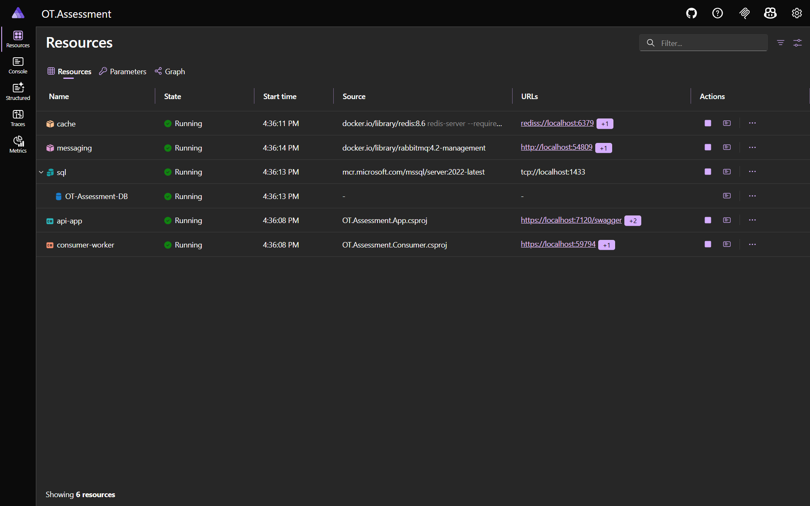
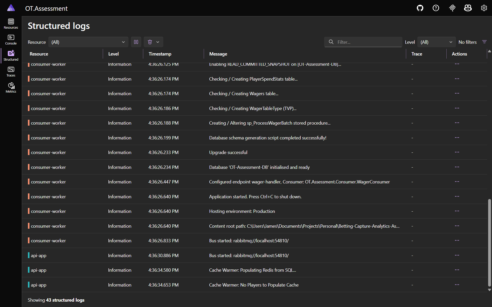

# Betting Capture Analytics Assessment

<div align="center">


</div>

<div align="center">

[](https://github.com/JAllsop/Betting-Capture-Analytics-Assessment/issues)
[](https://github.com/JAllsop/Betting-Capture-Analytics-Assessment/issues?q=is%3Aissue+is%3Aclosed)
[](https://github.com/JAllsop/Betting-Capture-Analytics-Assessment/pulls)
[](https://github.com/JAllsop/Betting-Capture-Analytics-Assessment/pulls?q=is%3Apr+is%3Aclosed)

</div>

## Overview

This project is the complete solution for the [**Online Betting Data Capture and Analytics System**](TASK.md) assessment. Implemented is a .NET 8 distributed architecture designed to ingest 500+ wager events per second via an asynchronous RabbitMQ pipeline, utilizing batched saves to SQL Server and real-time analytics (via [.NET Aspire](https://aspire.dev/)) and caching handled via Redis

For a detailed explanation of the architectural trade-offs, performance optimizations (such as denormalized DB schema, TVP batching, and dual-layer caching), 
and design decisions made to me the requirement - refer to the [**Architectural Notes (NOTES.md)**](NOTES.md)

## Project Management and Traceability

To demonstrate a professional development workflow, this project was managed using a structured kanban GitHub project, incorporating task-tracking:

- **Task Tracking:** Requirements and epics/tasks were planned and tracked using a [GitHub Project Board](https://github.com/users/JAllsop/projects/3)
- **Code Quality & Git Flow:** Feature development and merges were performed via [Closed Pull Requests](https://github.com/JAllsop/Betting-Capture-Analytics-Assessment/pulls?q=is%3Apr+is%3Aclosed)

## Table of Contents

- [Implementation Deviations](#implementation-deviations)
- [Features and Capabilities](#features-and-capabilities)
- [System Requirements](#system-requirements)
  - [Core Requirements](#core-requirements)
  - [Optional (Recommended)](#optional-recommended)
- [.NET Aspire Infrastructure](#net-aspire-infrastructure)
- [Architecture Workflow](#architecture-workflow)
- [Database Schema](#database-schema)
- [Benchmark and Load Test Results](#benchmark-and-load-test-results)
  - [Test Machine Specs:](#test-machine-specs)
  - [NBomber/`BogusTester` Configuration:](#nbomberbogustester-configuration)
  - [Data Audit and Persistence](#data-audit-and-persistence)
    - [Data Audit Results:](#data-audit-results)
- [API Performance (**During Load**):](#api-performance-during-load)
- [Getting Started (How to Run)](#getting-started-how-to-run)
  - [Profile 1: Docker Compose Hybrid (Recommended)](#profile-1-docker-compose-hybrid-recommended)
  - [Profile 2: .NET Aspire (Alternative)](#profile-2-net-aspire-alternative)
  - [Running the Load Test](#running-the-load-test)
- [Project Nuget Packages](#project-nuget-packages)

## Implementation Deviations

This solution utilizes **.NET Aspire** and **Docker** to provide a simple and easy setup process.
As a result, the prerequisites from the initial specification in [**Online Betting Data Capture and Analytics System**](TASK.md) were modified:

- **SQL Authentication vs Windows Auth:** The original spec requested `Integrated Security=SSPI` - because this solution runs SQL Server in a Linux-based Docker container, Windows Authentication is not supported. The system uses **SQL Authentication** (`sa` user with password `Guest123!`)
- **Orchestrated RabbitMQ:** Rather than requiring a manual RabbitMQ installation, the message broker is provisioned automatically as a containerized resource via the `Aspire AppHost` or via the `docker-compose.yaml` included

## System Requirements

To build and run this solution locally, ensure your environment meets the following core specifications:

### Core Requirements

- **[.NET 8.0 SDK](https://dotnet.microsoft.com/en-us/download/dotnet/8.0)** (or later): Required to compile, build, and run
- **[Docker Desktop](https://www.docker.com/products/docker-desktop/)** or a compatible container runtime: Required to host the SQL Server, RabbitMQ, and Redis
    <br/> *Note: Ensure the WSL 2 backend is enabled (if running on Windows)*
- **[Git](https://git-scm.com/downloads)**: Got cloning the repo

### Optional (Recommended)

The project can be managed/run completely standalone using the `dotnet` CLI (via the terminal), you can use **one** of the following IDEs which provide a better experience for debugging and review:

- **[Visual Studio 2022/2026](https://visualstudio.microsoft.com/downloads/)**
- **[JetBrains Rider](https://www.jetbrains.com/rider/)**
- **[VS Code](https://code.visualstudio.com/)**

## Features and Capabilities

- **Asynchronous Ingestion:** Wagers are proxied directly to RabbitMQ, enabling the API to return a success response quickly without waiting for database locks
- **Intelligent Batching:** Background consumer uses [MassTransit](https://www.nuget.org/packages/MassTransit.RabbitMQ) to buffer messages into batches of 200, executing bulk inserts into SQL Server via [Table-Valued Parameters (TVPs)](https://learn.microsoft.com/en-us/sql/relational-databases/tables/use-table-valued-parameters-database-engine?view=sql-server-ver17)
- **High-Performance Reads (Dual-Cache):** A Cache-Aside pattern utilizing Redis bypasses database reads (assisting during peak load):
  - **Leaderboard:** Stored in Redis Sorted Sets
  - **Wager History:** Paginated player queries are serialized and cache
- **Resilient Infrastructure:** Includes automated  [DbUp](https://www.nuget.org/packages/dbup-sqlserver) schema migrations, [Polly](https://www.nuget.org/packages/Polly) exponential backoff retries for container startup orchestration, and persistent volume mounts
- **3-Way Data Integrity Audit:** Tooling to check data integrity by comparing between the Load Tester, the API ingestion layer, and the DB

## .NET Aspire Infrastructure

<table width="100%">
  <tr>
    <td width="50%" align="center"><em>.NET Aspire Dashboard (Healthy Resources)</em></td>
    <td width="50%" align="center"><em>.NET Aspire Console Logs (Structured Logs disabled for performance)</em></td>
  </tr>
  <tr>
    <td></td>
    <td></td>
  </tr>
</table>

## Architecture Workflow

```mermaid
graph TD
    %% Define Styles
    classDef client fill:#f9f9f9,stroke:#333,stroke-width:2px;
    classDef api fill:#512BD4,stroke:#fff,stroke-width:2px,color:#fff;
    classDef queue fill:#FF6600,stroke:#fff,stroke-width:2px,color:#fff;
    classDef worker fill:#239120,stroke:#fff,stroke-width:2px,color:#fff;
    classDef db fill:#CC2927,stroke:#fff,stroke-width:2px,color:#fff;
    classDef cache fill:#DC382D,stroke:#fff,stroke-width:2px,color:#fff;

    Tester[Load Tester / Client]:::client

    subgraph App Layer
        API[REST API Proxy & Services]:::api
    end

    subgraph Messaging Layer
        Rabbit[(RabbitMQ)]:::queue
    end

    subgraph Consumer Layer
        Worker[Background Batch Consumer]:::worker
    end

    subgraph Data Layer
        Redis[(Redis Cache)]:::cache
        SQL[(SQL Server)]:::db
    end

    %% Ingestion Flow
    Tester -->|1. POST Wager| API
    API -->|2. Publish| Rabbit
    Rabbit -->|3. Consume| Worker
    Worker -->|4. Batch Insert TVP| SQL

    %% Read Flow
    Tester -.->|5. GET Analytics & History| API
    API -.->|6. Fetch Leaderboard & Paged Wagers| Redis
    Redis -.->|7. Cache Miss| SQL
    SQL -.->|8. Hydrate Cache & Return| API
  ```

## Database Schema

```mermaid
erDiagram
    Wagers {
        UNIQUEIDENTIFIER WagerId PK "NONCLUSTERED"
        UNIQUEIDENTIFIER AccountId "Indexed"
        DECIMAL Amount
        DATETIME2 CreatedDateTime "CLUSTERED INDEX"
        NVARCHAR Theme
        NVARCHAR Provider
        NVARCHAR GameName
        UNIQUEIDENTIFIER TransactionId
    }
    
    PlayerSpendStats {
        UNIQUEIDENTIFIER AccountId PK
        NVARCHAR Username
        DECIMAL TotalSpend
        DATETIME2 LastUpdated
    }
    
    WagerTableType {
        TABLE TVP "Used for Bulk Inserts"
    }
```
> **Architecture Note:** This schema is intentionally denormalized and lacks Foreign Key (FK) constraints to maximize write throughput. 
By removing referential integrity checks at the database level, the system avoids the overhead and locking associated with high-volume inserts. 
Integrity is instead guaranteed by the `sp_ProcessWagerBatch` SP

## Benchmark and Load Test Results

### Test Machine Specs:

**Dell Inspiron 16 6520**

- **Processor:** Intel(R) Core(TM) i9-14900KF @ 3.20 GHz (24 Cores, 32 Threads)
- **Memory:** 64.0 GB RAM
- **System Type:** 64-bit OS, x64-based processor
- **OS:** Windows 11 Pro (Version 23H2)

### NBomber/`BogusTester` Configuration:

``` plaintext
────────────────────────────────────────────────────── test info ───────────────────────────────────────────────────────

test suite: nbomber_default_test_suite_name
test name: nbomber_default_test_name
session id: 2026-03-31_14.44.03_session_2c84894d

──────────────────────────────────────────────────── scenario stats ────────────────────────────────────────────────────

scenario: hello_world_scenario
  - ok count: 7000
  - fail count: 0
  - all data: 0 MB
  - duration: 00:00:28

load simulations:
  - iterations_for_inject, rate: 500, interval: 00:00:02, iterations: 7000

┌─────────────────────────┬─────────────────────────────────────────────────────────┐
│                    step │ ok stats                                                │
├─────────────────────────┼─────────────────────────────────────────────────────────┤
│                    name │ global information                                      │
│           request count │ all = 7000, ok = 7000, RPS = 250                        │
│            latency (ms) │ min = 10.91, mean = 47.99, max = 720.74, StdDev = 63.18 │
│ latency percentile (ms) │ p50 = 26.62, p75 = 46.46, p95 = 167.55, p99 = 338.69    │
└─────────────────────────┴─────────────────────────────────────────────────────────┘
```

### Data Audit and Persistence

To validate the completed solution the system generates two JSON files within the `data_audit` directory during a test run. 
These files are used by the `TestComparisonService` to generate the 3-way integrity report

- **`sent_wagers_audit.json`**: Generated by the `BogusTester` - contains the every wager sent exactly as it was generated and sent by the load tester
- **`received_wagers_audit.json`**: Generated by the API via the `/api/Player/debug/testResults` endpoint - captures the wagers as they were handled by the API controllers before being published to the message broker

By comparing these two files against the live SQL `Wagers` table, the user can determine if any failures occured and whether there are any descrepencies in the data

The report can be generated by calling the API endpoint `/api/Player/debug/testResults` **after a test run**

#### Data Audit Results:

``` plaintext
Wager 3-Way Integrity Report
============================
1. Total Wagers Sent (Tester):  7000 (Unique: 6804)
2. Total Wagers Received (API): 7000 (Unique: 6804)
3. Total Wagers Saved (DB):     6804
----------------------------
[PASS] Network: All unique wagers successfully reached the API
[PASS] Persistence: DB count matches unique API receipts (Deduplication successful)

Top 10 Player Stats Comparison (DB vs Sent Unique Source):
(Duplicates have been removed from Sent Source for accurate comparison)

Player Josephine.Schaefer36 (f59886ce-2f76-9c52-cf27-a937828798df):
  - DB Spend: 431,745.57 | Sent Source: 431,745.57
  - Diff: 0.00 (MATCH)

Player Gerard_Reinger10 (0aeb4946-9aa3-cdc1-31eb-187f9d967169):
  - DB Spend: 425,333.13 | Sent Source: 425,333.13
  - Diff: 0.00 (MATCH)

Player Stuart.Considine7 (a41de994-c7bb-42a3-607d-0fb53798e8f6):
  - DB Spend: 422,105.91 | Sent Source: 422,105.92
  - Diff: -0.01 (MATCH)

Player Beulah29 (b4828e36-f5a1-0ad3-fee8-8cef5497e7fb):
  - DB Spend: 415,358.03 | Sent Source: 415,358.04
  - Diff: -0.01 (MATCH)

Player Richard_Wunsch (2ec848d1-2a45-8850-d792-971a647754ec):
  - DB Spend: 402,346.08 | Sent Source: 402,346.07
  - Diff: 0.01 (MATCH)

Player Ebony_Kemmer58 (d215ac3d-e99a-19cd-a84b-81e201004e92):
  - DB Spend: 400,840.98 | Sent Source: 400,840.96
  - Diff: 0.02 (MATCH)

Player Brandi.Spinka (1e125c82-fb74-1433-a83f-f4620745e4eb):
  - DB Spend: 399,713.58 | Sent Source: 399,713.59
  - Diff: -0.01 (MATCH)

Player Rachel67 (40986b34-bee7-0639-ab99-960b3dc6a933):
  - DB Spend: 394,748.58 | Sent Source: 394,748.59
  - Diff: -0.01 (MATCH)

Player Tasha_Reilly37 (d9d12813-a605-12e8-212b-9b3683ec9037):
  - DB Spend: 394,585.77 | Sent Source: 394,585.78
  - Diff: -0.01 (MATCH)

Player Sandy_Ward (b84ea7d0-3bab-08e5-d4fd-f63a9d8dbee3):
  - DB Spend: 390,132.71 | Sent Source: 390,132.71
  - Diff: 0.00 (MATCH)
```

## API Performance (**During Load**):

- `POST /casinowager (page size 10)`:
    - **255ms** (from DB)
    - **103ms** (from Redis Cache)
- `GET /topSpenders (count 10)`: 
    - **192ms** (from DB)
    - **103ms** (from Redis Cache)

## Getting Started (How to Run)

The database schema includes a custom password (`Guest123!`) and standardized port mappings to ensure compatibility across Aspire and Docker environments. Automated PowerShell scripts are provided in the `assets/scripts` directory to ensure environment variables and connection strings are correctly mapped in **Release** mode.
> **Note:** Swagger UI is enabled by default for this assessment

### Profile 1: Docker Compose Hybrid (Recommended)

This profile is for testing in a containerized infrastructure while running the .NET projects locally via the CLI. The script automatically handles infrastructure startup and launches the API and Consumer in separate terminal windows. Performance is optimal locally using this approach.

1. Open a terminal in the root directory
2. Run the Docker hybrid script:
   ```powershell
   .\assets\scripts\docker_run.ps1
   ```
3. The script will:
   - Spin up SQL Server, Redis, and RabbitMQ via Docker
   - Launch the `Consumer` in a new window
   - Launch the `App API` in a new window
4. Access Swagger UI at: `http://localhost:5021/swagger`

### Profile 2: .NET Aspire (Alternative)

.NET Aspire orchestrates the API, Worker, RabbitMQ, SQL Server, and Redis automatically. This script ensures the dashboard and telemetry are correctly initialized.
> Note: OpenTelemetry has been disabled by default to improve performance. Running Aspire locally has too much overhead and results are far worse than the docker method. In a real-world environment it would be deployed on a host machine and performance would be comparable

1. Open a terminal in the root directory
2. Run the Aspire orchestration script:
   ```powershell
   .\assets\scripts\aspire_run.ps1
   ```
3. Open the **Aspire Dashboard** (link provided in terminal) to view telemetry and access the Swagger UI endpoint
   <br/> > You can access the App API Swagger, RabbitMQ Web Portal, view SQL Connection Strings, and view system logs all from the Aspire Dashboard

### Running the Load Test

**CRITICAL INITIALIZATION STEP:** Before running the load test, you must wait for the infrastructure and database to fully initialize.

1. Ensure the infrastructure is running via **Profile 1** or **Profile 2**
2. **Wait for Health Checks:** * *Aspire:* Ensure all resources (`api-app`, `consumer-worker`, `sql`, `redis`, `messaging`) are marked as **Healthy** (green)
   - *Docker:* Ensure the terminal windows show the applications have successfully started and connected
3. **Verify Database Upgrade:** Ensure **DbUp** has successfully migrated the schema. Look for the "Success" log in the terminal or Aspire Console Logs
4. Once verified, run the automated tester script:
   ```powershell
   .\assets\scripts\tester_run.ps1
   ```
5. Monitor the `Consumer` logs to see wagers being processed and saved
6. Check the API endpoint `/api/Player/debug/testResults` to view the automated 3-way reconciliation audit

## Project Nuget Packages

* [`MassTransit.RabbitMQ` (8.5.8)](https://www.nuget.org/packages/MassTransit.RabbitMQ) – Message brokering and batching ([docs](https://masstransit-project.com/))
* [`Dapper` (2.1.72)](https://www.nuget.org/packages/Dapper) – High-performance micro-ORM for SQL reads/writes ([docs](https://github.com/DapperLib/Dapper))
* [`dbup-sqlserver` (7.2.0)](https://www.nuget.org/packages/dbup-sqlserver) – Automated schema migrations ([docs](https://dbup.readthedocs.io/en/latest/))
* [`StackExchange.Redis` (2.11.0)](https://www.nuget.org/packages/StackExchange.Redis) – Distributed caching ([docs](https://stackexchange.github.io/StackExchange.Redis/))
* [`Polly` (8.6.6)](https://www.nuget.org/packages/Polly) – Resilience pipelines (exponential backoffs for container startup) ([docs](https://www.pollydocs.org/))
* [`Aspire.Hosting.AppHost` (13.2.0)](https://www.nuget.org/packages/Aspire.Hosting.AppHost) – Infrastructure orchestration ([docs](https://aspire.dev/))
